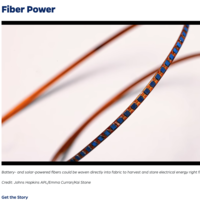

# textile-signal

Working list of related (Radio / Antenna / Signal Path) Weaving Projects

[Fractal Antennae - Aphroditi Psarra](https://afroditipsarra.com/work/fractal-antennae) Added 11/20/2024

[Textile Solar Power Battery - Johns Hopkins Applied Physics Laboratory, Konstantinos Gerasopoulos and Rachel Altmaier](https://www.jhuapl.edu/work/projects-and-missions/developing-battery-and-solar-powered-fibers) Added 11/21/2024

[Recording Studio Rya Rug behind Bert de Coteaux / Couteaux](https://www.historyofrecording.com/Bert_De_Coteaux.html) Added 11/22/2024

)

[High Twist Yarn Experiments](studentwork/Self-pleating-weaving-notes.md) Added 2/27/2025

[back to top](#textile-signal)
