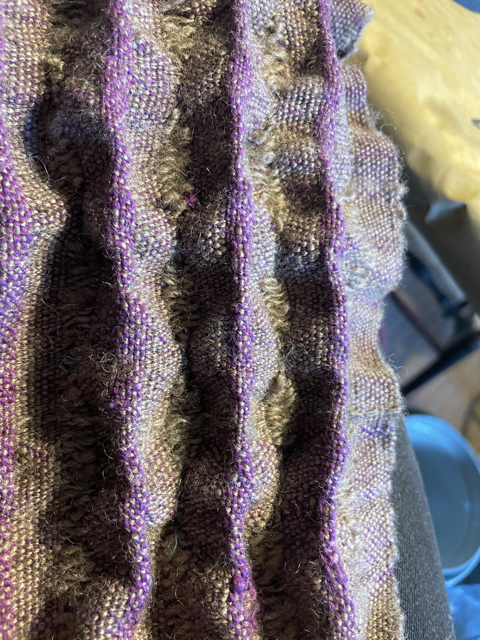

# February 11, 2025 Pleat sample wet finish

Sample of 1234 1234 56 56 56 1234 1234 787878 (plain weave combined with alternating warp float and weft loat cords, then alternating cords withboned with half hopsack handspun (hightwist?) and normal yarn pg 87-90)

sampler
+ warp made with a plant based normal twist purple yarn
+ weft alternates between hand spun wools, cotton, and the purple warp itself

wet finishing notes
- used 7th generation soap granules with warm water
- grey handspun wool highest fulling and shrinkage
- rinsed of detergent and laying on a rack to dry overnight or until full dry

Initial notes from wet fabric
- using a hand spun only warp creates more noticeable all over surface texture
- 15 epi made the pleats significantly spaced apart

Notes for next sampler
- higher twist yarn (retwisting something on my wheel)
   - crepe wool, crepe silk, buy some cones as a trial
- higher epa areas between cords

   

# February 12, 2025 Dried sample

Dried sample outcome notes:
- the cords are raised but the handspun wool floats did not create tight pleats.
- Good candidate for hand sewing the crepes with a gathering stitch, use for a hat

Bought cones from [Lunatic Fringe](https://lunaticfringeyarns.com/product/silk-crepe-yarn-gevolveyarns/) 

- Silk Crepe Yarn- GevolveYarns × 1	$13.50
- Linen Crepe Yarn- GevolveYarns - Z Twist (700 TPM) × 1 Twist: Z Twist (700 TPM) $11.00
- Linen Crepe Yarn- GevolveYarns - S Twist (1500 TPM) × 1 Twist: S Twist (1500 TPM) $11.00

# February 27, 2025 Hand sewn (invisible stitch) to create texture

I used a hand needle and the invisible stitch to create pleates following the lines of my floating yarn.
I found that tightly packed stitches created a high pressure pleat without ironing, AND an easy to twist area of fabric.
Creating looser and further spread out stitches created gentle waves across the fabric.
Alternating stitches on the top side for 1 inch, then bottom side for 1 inch, created a fascinating egg-crate texture

  

I also found that long areas of unpleated yarn interupted with fleats only on one side created an attractive color contrasting valley.

   
